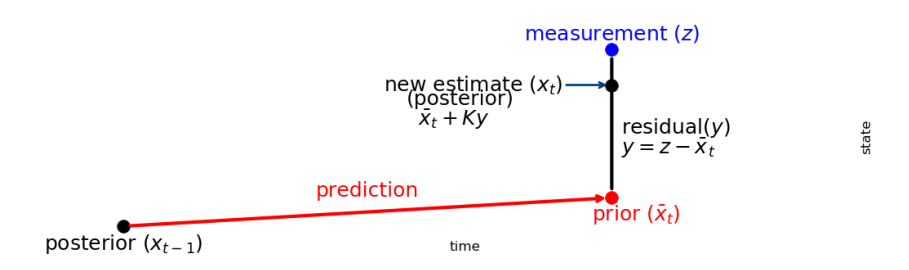

## Kalman Filter

A straightforward implementation of a Kalman Filter for linear dynamic systems. The Kalman class encapsulates the core steps of the filtering process:

- Initialization: Set up the state, covariance, and system matrices.
- Prediction: Propagate the current state and uncertainty forward using the system dynamics 
    (with optional control input).
- Update: Incorporate new measurements to correct the state estimate and reduce uncertainty.

Inline comments and references explain the theory and practical use of the Kalman Filter.

From [4]:

## Resources
- [1] [Kalman Filter from the Ground Up](https://www.kalmanfilter.net)
- [2] [Kalman Filter tutorial](https://youtu.be/18TKA-YWhX0)
- [3] [filterpy package](https://github.com/rlabbe/filterpy)
- [4] [Kalman and Bayesian filters in Python](https://github.com/rlabbe/Kalman-and-Bayesian-Filters-in-Python)